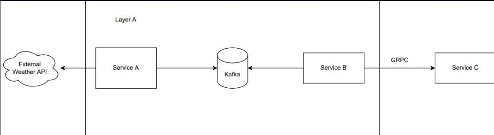

# ТЗ

Система состоит из трех сервисов:

1. **Service A**:
   - Забирает текущую погоду в г. Казани из открытого источника раз в минуту.
   - Отправляет данные о погоде в Kafka в топик `weather`.

2. **Service B**:
   - Consume-ит данные из топика `weather`.
   - Отправляет данные в Service C через gRPC метод `SetWeather`.

3. **Service C**:
   - Реализует gRPC метод `SetWeather` для получения данных о погоде.
   - Хранит последние 10 значений погоды.
   - Отдает последние 10 значений погоды и времени их получения через GraphQL API.

## Чтобы всё заработало 

Поднимаете компоузник 
Меняйте данные постгреса в конфигах и в файле EfFactory
Запускаете проекты 
Сначала запускаете WeatherDataService потом WeatherConsumer и WeatherProducer

